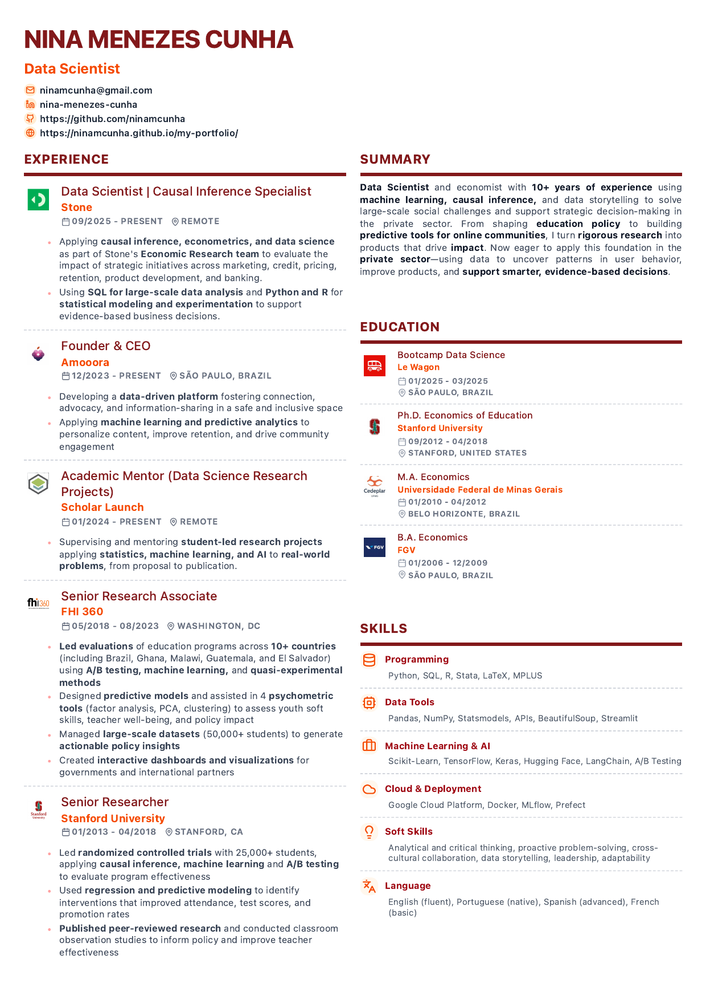

🇺🇸 English | [🇧🇷 Português](./README_PT.md)

# Professional Resume Template

[](https://react.dev/)
[](https://www.typescriptlang.org/)
[](https://tailwindcss.com/)
[](https://vitejs.dev/)
[](https://pages.github.com/)
[](https://github.com/ninamcunha/professional-resume/actions/workflows/deploy.yml)
[](./LICENSE)

**Bilingual professional resume template (EN/PT) with downloadable PDFs, responsive layout, and automatic GitHub Pages deployment.**

[Live Demo](https://ninamcunha.github.io/professional-resume/) •
[English PDF](https://ninamcunha.github.io/professional-resume/pdfs/Nina_Menezes_Cunha_Resume_EN.pdf) •
[Portuguese PDF](https://ninamcunha.github.io/professional-resume/pdfs/Nina_Menezes_Cunha_Resume_PT.pdf) •
[Report an Issue](../../issues)

---

## Table of Contents

- [About the Project](#about-the-project)
- [Features](#features)
- [Preview](#preview)
- [Technology Stack](#technology-stack)
- [Project Structure](#project-structure)
- [Installation](#installation)
- [How to Use](#how-to-use)
- [Customization](#customization)
- [PDF Export](#pdf-export)
- [Deployment](#deployment)
- [Automatic Deployment with GitHub Actions](#automatic-deployment-with-github-actions)
- [How to Replicate This Resume](#how-to-replicate-this-resume)
- [Available Scripts](#available-scripts)
- [Notes and Troubleshooting](#notes-and-troubleshooting)
- [Contributing](#contributing)
- [License](#license)
- [Author](#author)

---

## About the Project

This is a **professional resume template** built with React, TypeScript and Vite, designed for public sharing, PDF export, and easy reuse by other professionals.

The project includes:

- bilingual content support (English and Portuguese)
- clean responsive layout
- print-friendly design
- downloadable PDF versions
- structured resume data separated from UI
- GitHub Pages publishing
- a setup that can be reused as a public professional CV template

This repository can be used as:

- your own online resume
- a professional CV template
- a base for a public profile or portfolio
- a clean starter for bilingual personal branding sites

---

## Features

### Complete Bilingual System

- PT/EN content structure
- separate language data files
- easy editing and localization
- clear PDF versions for each language

### PDF Distribution

- final exported PDFs stored inside `public/pdfs`
- direct public download links
- preview based on the generated PDF
- printable layout optimized for professional sharing

### Content Structure

- header and personal links
- professional summary
- experience
- publications and projects
- education
- certifications
- skills

### Layout and Usability

- responsive behavior for desktop and mobile
- organized content blocks
- reusable structure for adaptation
- easy GitHub Pages publishing

---

## Preview

English version preview:

<p align="center">
  
</p>

You can also open the full PDF directly:

https://ninamcunha.github.io/professional-resume/pdfs/Nina_Menezes_Cunha_Resume_EN.pdf

---

## Technology Stack

### Core

| Technology | Description |
|------------|-------------|
| **React** | UI library |
| **TypeScript** | Typed JavaScript |
| **Vite** | Frontend build tool |
| **Tailwind CSS** | Utility-first styling |
| **GitHub Pages** | Static site hosting |

### Main Libraries

| Library | Usage |
|---------|-------|
| **lucide-react** | Icons |
| **@radix-ui/** | Accessible UI building blocks |
| **class-variance-authority** | CSS class variants |
| **tailwind-merge** | Tailwind class merging |

### Other Libraries Present in the Project

- `react-router`
- `motion`
- `date-fns`
- `sonner`

---

## Project Structure

```text
professional-resume
├── .github
│   └── workflows
│       └── deploy.yml
├── docs
│   ├── preview_en.png
│   └── preview_pt.png
├── public
│   └── pdfs
│       ├── Nina_Menezes_Cunha_Resume_EN.pdf
│       └── Nina_Menezes_Cunha_Resume_PT.pdf
├── src
│   ├── app
│   │   ├── App.tsx
│   │   ├── components
│   │   └── data
│   │       ├── resumeEN.ts
│   │       └── resumePT.ts
│   ├── assets
│   ├── styles
│   └── main.tsx
├── ATTRIBUTIONS.md
├── guidelines
│   └── Guidelines.md
├── index.html
├── package.json
├── package-lock.json
├── postcss.config.mjs
├── vite.config.ts
├── README.md
└── README_PT.md
```

### Main Files

#### `src/app/App.tsx`
- root component
- language state
- print and PDF flow
- page structure and orchestration

#### `src/app/components/Resume.tsx`
- main resume component
- mobile and desktop layout
- section rendering
- reusable display structure

#### `src/app/data/resumeEN.ts` and `src/app/data/resumePT.ts`
- structured resume content
- personal links
- experience, education, certifications, skills, projects
- easiest place to customize the template

#### `public/pdfs`
- final export-ready PDF versions
- publicly accessible from GitHub Pages

---

## Installation

### Prerequisites

- Node.js 18+
- npm

### Clone the repository

```bash
git clone https://github.com/your-username/professional-resume.git
cd professional-resume
```

### Install dependencies

```bash
npm install
```

### Run the development server

```bash
npm run dev
```

### Open locally

```text
http://localhost:5173
```

If the browser does not open automatically, copy the local address shown in the terminal and open it manually.

---

## How to Use

### Switch language
Use the interface controls to switch between English and Portuguese content.

### Open the live version
Use the GitHub Pages link:

https://ninamcunha.github.io/professional-resume/

### Download the PDFs
Use the direct public links:

- English: https://ninamcunha.github.io/professional-resume/pdfs/Nina_Menezes_Cunha_Resume_EN.pdf
- Portuguese: https://ninamcunha.github.io/professional-resume/pdfs/Nina_Menezes_Cunha_Resume_PT.pdf

### Preview the production build locally

```bash
npm run build
npm run preview
```

---

## Customization

### 1. Update the resume content

Edit:

```text
src/app/data/resumeEN.ts
src/app/data/resumePT.ts
```

These files contain the structured content for each language, including:

- header
- summary
- experience
- education
- certifications
- skills
- projects/publications

### 2. Replace logos and visual assets

Update files inside:

```text
src/assets
```

Recommended:
- keep readable filenames
- organize by category if you expand the project
- update imports when renaming files

### 3. Replace the exported PDFs

Put your final PDFs inside:

```text
public/pdfs
```

Example:

```text
public/pdfs/My_Resume_EN.pdf
public/pdfs/My_Resume_PT.pdf
```

### 4. Adjust links and personal metadata

Update:
- LinkedIn
- GitHub
- portfolio
- email
- any public links inside your data files

### 5. Adjust repository-specific settings

If you rename the repository, update the base path in:

```text
vite.config.ts
```

Example:

```ts
base: '/my-professional-resume/',
```

---

## PDF Export

### Recommended flow

1. finalize the content in the app
2. export your final PDF versions
3. save them in `public/pdfs`
4. publish or redeploy the project

### Why keep PDFs in `public/pdfs`?

Because files inside `public/` are exposed directly by Vite and GitHub Pages. That makes them ideal for:

- resume downloads
- sharing links
- keeping a stable final exported version alongside the site

### Resulting public paths

```text
/pdfs/Nina_Menezes_Cunha_Resume_EN.pdf
/pdfs/Nina_Menezes_Cunha_Resume_PT.pdf
```

---

## Deployment

### Manual deployment using npm

Build and publish with:

```bash
npm run build
npm run deploy
```

### GitHub Pages settings

Open:

**Repository → Settings → Pages**

Then configure:

- **Source:** Deploy from a branch
- **Branch:** `gh-pages`
- **Folder:** `/(root)`

### Important note

If the page opens blank after deployment, the most common cause is an incorrect `base` value in `vite.config.ts`.

For example:

```ts
base: '/professional-resume/',
```

must match the actual repository name.

---

## Automatic Deployment with GitHub Actions

This repository can also be configured to deploy automatically on every push to `main`.

### What it does

- installs dependencies
- builds the project
- publishes the site automatically
- removes the need to run `npm run deploy` manually

### Recommended workflow file

Create:

```text
.github/workflows/deploy.yml
```

And use the workflow provided alongside this README.

### After enabling it

Your deployment flow becomes:

```text
git push -> GitHub Action builds -> GitHub Pages updates automatically
```

---

## How to Replicate This Resume

This section is for anyone who wants to reuse the project for their own resume.

### Step 1 — Fork or clone the repository

You can either:

- fork the repository on GitHub, or
- clone it and create your own repository from it

```bash
git clone https://github.com/your-username/professional-resume.git
cd professional-resume
```

### Step 2 — Install dependencies

```bash
npm install
```

### Step 3 — Update the project name

Open `package.json` and change the project name, for example:

```json
"name": "my-professional-resume"
```

Then run again:

```bash
npm install
```

### Step 4 — Replace the resume content

Edit:

```text
src/app/data/resumeEN.ts
src/app/data/resumePT.ts
```

### Step 5 — Replace logos

Update:

```text
src/assets
```

### Step 6 — Replace your PDFs

Put your exported files inside:

```text
public/pdfs
```

### Step 7 — Update the base path

Open:

```text
vite.config.ts
```

Set the correct repository path:

```ts
base: '/your-repository-name/',
```

### Step 8 — Choose your deployment mode

#### Option A — Manual
```bash
npm install -D gh-pages
npm run build
npm run deploy
```

#### Option B — Automatic with GitHub Actions
Add the workflow file and push to `main`.

### Step 9 — Enable GitHub Pages

Configure Pages in the repository settings.

### Step 10 — Open the final site

```text
https://your-username.github.io/your-repository-name/
```

---

## Available Scripts

```bash
npm run dev
npm run build
npm run preview
npm run deploy
```

---

## Notes and Troubleshooting

- `public/` is exposed at the site root
- `gh-pages` is created when running `npm run deploy`
- a blank page usually means the `base` path is wrong
- if PDFs do not open, redeploy after adding them to `public/pdfs`
- if you change repository name, update `vite.config.ts`

---

## Contributing

Contributions are welcome.

Suggested flow:

1. fork the project
2. create a branch
3. commit your changes
4. push your branch
5. open a pull request

---

## License

This project can be kept under the MIT License for public reuse.

---

## Author

**Nina Menezes Cunha**

- LinkedIn: [nina-menezes-cunha](https://linkedin.com/in/nina-menezes-cunha)
- GitHub: [@ninamcunha](https://github.com/ninamcunha)

---

## Acknowledgments

- React
- TypeScript
- Vite
- Tailwind CSS
- GitHub Pages
- Lucide Icons
- Radix UI

---

<div align="center">

Built with care for a clean public professional profile.

</div>
