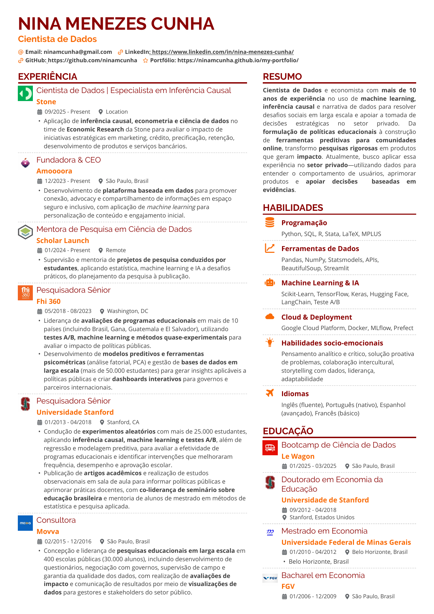

[🇺🇸 English](./README.md) | 🇧🇷 Português

# Template de Currículo Profissional

[](https://react.dev/)
[](https://www.typescriptlang.org/)
[](https://tailwindcss.com/)
[](https://vitejs.dev/)
[](https://pages.github.com/)
[](https://github.com/ninamcunha/professional-resume/actions/workflows/deploy.yml)
[](./LICENSE)

**Template de currículo profissional bilíngue (PT/EN), com PDFs para download, layout responsivo e deploy automático no GitHub Pages.**

[Demo ao Vivo](https://ninamcunha.github.io/professional-resume/) •
[PDF em Inglês](https://ninamcunha.github.io/professional-resume/pdfs/Nina_Menezes_Cunha_Resume_EN.pdf) •
[PDF em Português](https://ninamcunha.github.io/professional-resume/pdfs/Nina_Menezes_Cunha_Resume_PT.pdf) •
[Reportar Problema](../../issues)

---

## Índice

- [Sobre o Projeto](#sobre-o-projeto)
- [Funcionalidades](#funcionalidades)
- [Preview](#preview)
- [Stack Utilizada](#stack-utilizada)
- [Estrutura do Projeto](#estrutura-do-projeto)
- [Instalação](#instalação)
- [Como Usar](#como-usar)
- [Customização](#customização)
- [Exportação em PDF](#exportação-em-pdf)
- [Deploy](#deploy)
- [Deploy Automático com GitHub Actions](#deploy-automático-com-github-actions)
- [Como Replicar Este Currículo](#como-replicar-este-currículo)
- [Scripts Disponíveis](#scripts-disponíveis)
- [Observações e Troubleshooting](#observações-e-troubleshooting)
- [Contribuindo](#contribuindo)
- [Licença](#licença)
- [Autor](#autor)

---

## Sobre o Projeto

Este é um **template de currículo profissional** feito com React, TypeScript e Vite, pensado para publicação pública, exportação em PDF e reaproveitamento por outras pessoas.

O projeto inclui:

- suporte bilíngue (Português e Inglês)
- layout limpo e responsivo
- visual pronto para impressão
- versões em PDF para download
- dados do currículo separados da interface
- publicação com GitHub Pages
- estrutura reaproveitável como template de currículo público

Este repositório pode ser usado como:

- seu currículo online
- um template profissional de CV
- base para um perfil público ou portfolio
- ponto de partida para um site pessoal bilíngue

---

## Funcionalidades

### Sistema Bilíngue Completo

- conteúdo em PT e EN
- arquivos de dados separados por idioma
- edição simples do conteúdo
- versões em PDF distintas por idioma

### Distribuição em PDF

- PDFs finais armazenados em `public/pdfs`
- links públicos diretos para download
- preview baseado no PDF gerado
- layout otimizado para impressão profissional

### Estrutura de Conteúdo

- header e links pessoais
- resumo profissional
- experiências
- publicações e projetos
- educação
- certificações
- habilidades

### Layout e Usabilidade

- responsividade para desktop e mobile
- blocos organizados de conteúdo
- estrutura reutilizável
- publicação simples no GitHub Pages

---

## Preview

Preview em português:

<p align="center">
  
</p>

Você também pode abrir o PDF completo diretamente:

https://ninamcunha.github.io/professional-resume/pdfs/Nina_Menezes_Cunha_Resume_PT.pdf

---

## Stack Utilizada

### Core

| Tecnologia | Descrição |
|------------|-----------|
| **React** | Biblioteca de interface |
| **TypeScript** | JavaScript tipado |
| **Vite** | Build tool frontend |
| **Tailwind CSS** | Estilização utility-first |
| **GitHub Pages** | Hospedagem estática |

### Bibliotecas Principais

| Biblioteca | Uso |
|------------|-----|
| **lucide-react** | Ícones |
| **@radix-ui/** | Componentes acessíveis |
| **class-variance-authority** | Variantes de classe |
| **tailwind-merge** | Merge de classes Tailwind |

### Outras bibliotecas presentes no projeto

- `react-router`
- `motion`
- `date-fns`
- `sonner`

---

## Estrutura do Projeto

```text
professional-resume
├── ATTRIBUTIONS.md
├── README.md
├── README_PT.md
├── guidelines
│   └── Guidelines.md
├── index.html
├── package-lock.json
├── package.json
├── postcss.config.mjs
├── public
│   └── pdfs
│       ├── Nina_Menezes_Cunha_Resume_EN.pdf
│       └── Nina_Menezes_Cunha_Resume_PT.pdf
├── src
│   ├── app
│   │   ├── App.tsx
│   │   ├── components
│   │   ├── data
│   │   │   ├── resumeEN.ts
│   │   │   └── resumePT.ts
│   │   └── data.ts
│   ├── assets
│   ├── main.tsx
│   └── styles
│       ├── fonts.css
│       ├── index.css
│       ├── tailwind.css
│       └── theme.css
└── vite.config.ts
```

### Arquivos Principais

#### `src/app/App.tsx`
- componente raiz
- estado de idioma
- fluxo de impressão e PDF
- estrutura geral da página

#### `src/app/components/Resume.tsx`
- componente principal do currículo
- layout mobile e desktop
- renderização das seções
- estrutura reutilizável de exibição

#### `src/app/data/resumeEN.ts` e `src/app/data/resumePT.ts`
- conteúdo estruturado do currículo
- links pessoais
- experiências, educação, certificações, habilidades e projetos
- ponto mais simples para personalizar o template

#### `public/pdfs`
- versões finais dos PDFs
- acessíveis publicamente no GitHub Pages

---

## Instalação

### Pré-requisitos

- Node.js 18+
- npm

### Clonar o repositório

```bash
git clone https://github.com/seu-usuario/professional-resume.git
cd professional-resume
```

### Instalar dependências

```bash
npm install
```

### Rodar servidor de desenvolvimento

```bash
npm run dev
```

### Abrir localmente

```text
http://localhost:5173
```

Se o navegador não abrir automaticamente, copie o endereço mostrado no terminal e cole manualmente no navegador.

---

## Como Usar

### Alternar idioma
Use os controles da interface para alternar entre os conteúdos em Português e Inglês.

### Abrir a versão publicada
Use o link do GitHub Pages:

https://ninamcunha.github.io/professional-resume/

### Baixar os PDFs
Use os links públicos diretos:

- Inglês: https://ninamcunha.github.io/professional-resume/pdfs/Nina_Menezes_Cunha_Resume_EN.pdf
- Português: https://ninamcunha.github.io/professional-resume/pdfs/Nina_Menezes_Cunha_Resume_PT.pdf

### Visualizar build local de produção

```bash
npm run build
npm run preview
```

---

## Customização

### 1. Atualizar o conteúdo do currículo

Edite:

```text
src/app/data/resumeEN.ts
src/app/data/resumePT.ts
```

Esses arquivos contêm:

- header
- summary
- experience
- education
- certifications
- skills
- projects/publications

### 2. Substituir logos e assets visuais

Atualize os arquivos dentro de:

```text
src/assets
```

Recomendado:
- manter nomes legíveis
- organizar por categoria se expandir o projeto
- atualizar os imports ao renomear arquivos

### 3. Substituir os PDFs exportados

Coloque seus PDFs finais em:

```text
public/pdfs
```

Exemplo:

```text
public/pdfs/Meu_Curriculo_EN.pdf
public/pdfs/Meu_Curriculo_PT.pdf
```

### 4. Ajustar links e dados pessoais

Atualize:
- LinkedIn
- GitHub
- portfolio
- email
- links públicos presentes nos arquivos de dados

### 5. Ajustar configurações específicas do repositório

Se você mudar o nome do repositório, atualize o base path em:

```text
vite.config.ts
```

Exemplo:

```ts
base: '/meu-curriculo-profissional/',
```

---

## Exportação em PDF

### Fluxo recomendado

1. finalize o conteúdo no app
2. exporte as versões finais em PDF
3. salve os arquivos em `public/pdfs`
4. publique ou faça o redeploy do projeto

### Por que manter PDFs em `public/pdfs`?

Porque arquivos dentro de `public/` são expostos diretamente pelo Vite e pelo GitHub Pages. Isso é ideal para:

- download do currículo
- compartilhamento direto por link
- manter uma versão final estável junto do site

### Caminhos públicos resultantes

```text
/pdfs/Nina_Menezes_Cunha_Resume_EN.pdf
/pdfs/Nina_Menezes_Cunha_Resume_PT.pdf
```

---

## Deploy

### Deploy manual com npm

Publique com:

```bash
npm run build
npm run deploy
```

### Configuração do GitHub Pages

Abra:

**Repositório → Settings → Pages**

Depois configure:

- **Source:** Deploy from a branch
- **Branch:** `gh-pages`
- **Folder:** `/(root)`

### Observação importante

Se a página abrir em branco depois do deploy, a causa mais comum é um valor incorreto de `base` em `vite.config.ts`.

Por exemplo:

```ts
base: '/professional-resume/',
```

precisa corresponder exatamente ao nome real do repositório.

---

## Deploy Automático com GitHub Actions

Este repositório também pode ser configurado para fazer deploy automático a cada push em `main`.

### O que isso faz

- instala dependências
- gera o build do projeto
- publica o site automaticamente
- elimina a necessidade de rodar `npm run deploy` manualmente

### Arquivo recomendado

Crie:

```text
.github/workflows/deploy.yml
```

e use o workflow fornecido junto deste README.

### Depois de ativar

Seu fluxo de publicação vira:

```text
git push -> GitHub Action faz o build -> GitHub Pages atualiza automaticamente
```

---

## Como Replicar Este Currículo

Esta seção é para qualquer pessoa que queira reutilizar o projeto no próprio currículo.

### Passo 1 — Fazer fork ou clonar o repositório

Você pode:

- fazer fork no GitHub, ou
- clonar e criar um novo repositório a partir dele

```bash
git clone https://github.com/seu-usuario/professional-resume.git
cd professional-resume
```

### Passo 2 — Instalar dependências

```bash
npm install
```

### Passo 3 — Atualizar o nome do projeto

Abra `package.json` e altere o nome, por exemplo:

```json
"name": "meu-curriculo-profissional"
```

Depois rode novamente:

```bash
npm install
```

### Passo 4 — Substituir o conteúdo do currículo

Edite:

```text
src/app/data/resumeEN.ts
src/app/data/resumePT.ts
```

### Passo 5 — Trocar logos

Atualize:

```text
src/assets
```

### Passo 6 — Trocar seus PDFs

Coloque os arquivos exportados dentro de:

```text
public/pdfs
```

### Passo 7 — Atualizar o base path

Abra:

```text
vite.config.ts
```

Defina o caminho correto do repositório:

```ts
base: '/nome-do-seu-repositorio/',
```

### Passo 8 — Escolher modo de deploy

#### Opção A — Manual
```bash
npm install -D gh-pages
npm run build
npm run deploy
```

#### Opção B — Automático com GitHub Actions
Adicione o workflow e faça push para `main`.

### Passo 9 — Ativar o GitHub Pages

Configure o Pages nas configurações do repositório.

### Passo 10 — Abrir o site final

```text
https://seu-usuario.github.io/nome-do-seu-repositorio/
```

---

## Scripts Disponíveis

```bash
npm run dev
npm run build
npm run preview
npm run deploy
```

---

## Observações e Troubleshooting

- `public/` é exposto na raiz do site
- `gh-pages` é criado ao rodar `npm run deploy`
- página em branco normalmente significa `base` incorreto
- se os PDFs não abrirem, faça redeploy depois de adicioná-los em `public/pdfs`
- se mudar o nome do repositório, atualize `vite.config.ts`

---

## Contribuindo

Contribuições são bem-vindas.

Fluxo sugerido:

1. faça fork do projeto
2. crie uma branch
3. commit suas mudanças
4. envie a branch
5. abra um pull request

---

## Licença

Este projeto pode ser mantido sob licença MIT para reutilização pública.

---

## Autor

**Nina Menezes Cunha**

- LinkedIn: [nina-menezes-cunha](https://linkedin.com/in/nina-menezes-cunha)
- GitHub: [@ninamcunha](https://github.com/ninamcunha)

---

## Agradecimentos

- React
- TypeScript
- Vite
- Tailwind CSS
- GitHub Pages
- Lucide Icons
- Radix UI

---

<div align="center">

Feito com cuidado para um perfil profissional público limpo e reutilizável.

</div>
